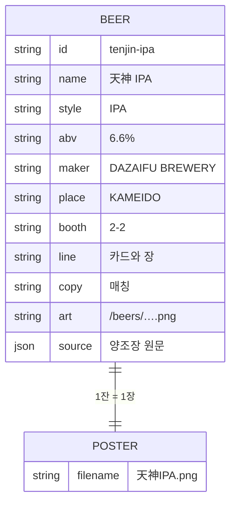

# 今夜 — 맥주 · 포스터

비교 숫자·선택지는 [`DATA.md`](DATA.md). 이 문서는 **잔과 장**.

추천 순간에 그림을 그리지 않는다. 맥주 레코드에 필드가 있고, 같은 テンプレ로 장이 나온다. 저장은 그 장을 PNG로 받는다.

---

## 한 줄

첫 화면은 오늘 잔. 스크롤하면 고른 것, 소장용 장, 부스, 2·3위.

---

## 스크롤 순서

```
1  오늘 잔          이름 · 병 · 한 줄 · 장소
2  선
3  今夜の選び        고른 3개
4  購入できる場所    부스 지도
5  つぎの一杯        2위 · 3위 (작은 병 그림)
6  카드             カードを受け取る
7  もう一度
```

장은 첫 화면에 이미 있다. 같은 병을 9:16으로 다시 그리지 않는다.
카드는 이야기를 다 본 다음, 출구에서 받는다. 2·3위 앞이 아니다.

---

## 포스터 テンプレ

슬롯은 `Item` 필드뿐.

```
{style}                         {abv}

            {name}

              [병]

            {line}

{place}
```

| 칸 | 필드 | 예 |
|---|---|---|
| 좌상 | `style` | IPA |
| 우상 | `abv` | 6.6% |
| 이름 | `name` | 天神 IPA |
| 병 | `art` `/beers/{id}.png` | 누끼. 아래 규격 |
| 한 줄 | `line` | トロピカルな香り、キレのある苦み。 |
| 장소 | `place` | KAMEIDO |

색은 장 안만. 크림 바탕, 이름은 세이지. 앱 크롬은 무채색.

저장 파일 이름: `poster.filename` → `天神IPA.png` (1080×1920).

에이아이가 하는 것: 결과 문장(나레이션)만. 장은 템플릿.

---

## 병 PNG

화면 박스(`h-bottle`)가 같다. 캔버스 비율이 같아야 광학 높이가 같다.

1. 누끼. 투명. 뚜껑·병·바닥을 자르지 않는다.
2. 캔버스 **세로 3 : 가로 1**.
3. 병은 높이의 **90%**, 가로 가운데. 위아래 여백 같다.
4. **픽셀을 키우지 않는다.** 작은 사진은 작은 3:1 캔버스.
5. 경로 `public/beers/{id}.png`. `tonight.ts`의 `art`만 바꾼다.

코드 주석: `src/components/bottle.tsx`.

---

## 레코드

```
BEER
 ├─ id name style abv maker
 ├─ place booth
 ├─ line          카드·포스터에 보이는 한 줄
 ├─ copy          매칭용 공식 설명
 ├─ source        양조장 원문. 고치지 않음
 │    kind / ingredients / shelf / text
 ├─ art           누끼 병 PNG. 없으면 공통 병
 ├─ bottle        tall | stout | wide
 └─ poster.filename
```



---

## 지금 잔

실제 오는 맥주부터 넣는다. 설명은 양조장 문장 그대로 `source.text`.

| id | 이름 | 스타일 | ABV | 양조 | 장소 | 원문 | 병 |
|---|---|---|---|---|---|---|---|
| heiwa-red-ale | 平和クラフト レッドエール | RED ALE | 5.0% | 平和酒造 | WAKAYAMA | 있음 | /beers/heiwa-red-ale.png |
| heiwa-white-ale | 平和クラフト ホワイトエール | WHITE ALE | 5.0% | 平和酒造 | WAKAYAMA | 있음 | /beers/heiwa-white-ale.png |
| heiwa-pale-ale | 平和クラフト ペールエール | PALE ALE | 5.0% | 平和酒造 | WAKAYAMA | 있음 | /beers/heiwa-pale-ale.png |
| rydeen-weizen | ライディーンビール ヴァイツェン | WEIZEN | 5.0% | 猿倉山ビール醸造所 | MINAMIUONUMA | 있음 | /beers/rydeen-weizen.png |
| rydeen-alt | ライディーンビール アルト | ALT | 5.0% | 猿倉山ビール醸造所 | MINAMIUONUMA | 있음 | /beers/rydeen-alt.png |
| rydeen-ipa | ライディーンビール IPA | IPA | 6.0% | 猿倉山ビール醸造所 | MINAMIUONUMA | 있음 | /beers/rydeen-ipa.png |
| rydeen-pilsner | ライディーンビール ピルスナー | PILSNER | 5.0% | 猿倉山ビール醸造所 | MINAMIUONUMA | 있음 | /beers/rydeen-pilsner.png |

`line` / `copy` / `source`는 [`src/experiences/tonight.ts`](src/experiences/tonight.ts).

잔이 들어오면 이 표에 행만 늘린다. 장 テンプレ는 그대로.

---

## 저장

- 카피: `ブースで一杯お買い上げの方に、この絵のカードを。`
- 버튼: `カードを受け取る` (기존 pill. 다운로드라고 쓰지 않음)
- DOM 캡처 없음. テンプレ를 1080×1920에 그려 PNG
- 가능하면 공유 시트, 아니면 파일
- 2·3위에는 저장 버튼을 두지 않음. 부스에서 알아보는 작은 병 그림만.

---

## 2·3위

`compare`의 `ranked`에서 1위 다음 둘. 새 점수 없음. 탭해도 추천을 다시 돌리지 않음.
