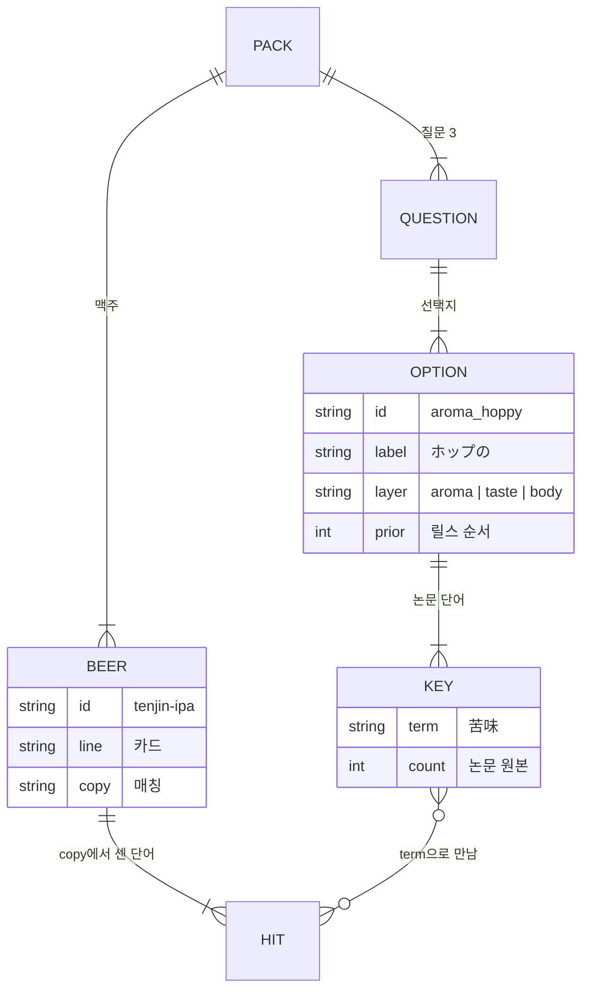

# 今夜 — 데이터 구조

맥주 포스터·소장은 [`BEERS.md`](BEERS.md).

숫자 원본은 [`src/experiences/lexicon.ts`](src/experiences/lexicon.ts). 이 문서는 보면서 다듬기 위한 설계도.
맥주 목록·화면 문장은 [`src/experiences/tonight.ts`](src/experiences/tonight.ts). 비교는 [`src/lib/thin-path/compare.ts`](src/lib/thin-path/compare.ts).

Postgres 없음. 로그인 없음. 이 파일들이 DB.

한 줄 카피는 `grok-4-fast`. 키는 `XAI_API_KEY` 환경변수. 값은 적지 않는다. 넣는 칸은 [`.env.example`](.env.example). 비어 있으면 맥주 정본 문장을 쓴다.

출처: 北島・酒井「商品説明文で表現されるクラフトビールの特徴」
[日本感性工学会論文誌 22(4)](https://www.jstage.jst.go.jp/article/kansei/22/4/22_184/_pdf)

---

## 이렇게 읽으면 된다

표는 나중에. 한 잔만 따라간다.

1. 사람이 고르는 것 — `ホップの` `ほろ苦い` `軽快な`
2. 맥주가 가진 것 — 설명문 `copy`. 天神 IPA면 `ホップの香り。トロピカルなアロマとキレのある苦み。爽やかな口当たり。`
3. 겹치는 단어를 센다. ホップ·苦み·口当たり가 있으면 점수가 오른다.
4. 향·맛·입을 **따로** 센 뒤 셋의 평균. 향 단어가 많아도 입안이 0점이 되지 않게.

화면의 はじまり / さかり / なごり 가 향 / 맛 / 입안이다. 그 말은 안 쓴다.

아래 표의 `%`는 “이 선택지가 그 단어를 얼마나 들고 있나”일 뿐이다. 릴스 위→아래 순서는 `prior` (논문에서 그 말이 몇 번 나왔나).

---

## 왜 말 뒤에 묶음이 붙나

고른 말 하나만 보면 맥주 설명과 안 만난다.

`ホップの`를 골라도 라벨에는 `ホップ`만 안 적혀 있고 `香り` `苦味`가 같이 나온다. 논문이 그 묶음을 보여 준 것이다. 그 말들까지 뒤에 붙여야 「이 잔이 그 감각이다」라고 셀 수 있다.

안 붙이면 `ホップ` 글자가 있는 맥주만 이기고, 같은 느낌인데 다른 말로 쓴 잔은 빠진다.

뒤에 붙는 말은 **그 맥주의 설명문이 아니다.** 논문이 「이 감각이면 이런 말을 같이 쓴다」고 모아 둔 묶음이다. 그래서 사람 쪽은 대략이다.

맥주 쪽은 **그 잔의 실제 문장** `copy`다. 지금 짧은 한두 줄이라 겹칠 구멍이 작다. 더 정확히 붙이려면 각 맥주의 공식 설명을 더 넣으면 된다.

- 묶음 `keys` = 사람 쪽 (논문)
- 설명문 `copy` = 맥주 쪽 (그 잔)

둘 다 있어야 만난다.

---

## 덩어리

```
PACK tonight
 ├─ QUESTION ×3     はじまり / さかり / なごり
 │    └─ OPTION     사람이 고르는 형용사
 │         ├─ prior    논문 총출현. 릴스 위→아래 순서
 │         └─ keys[]   term + count. 비교 때 합을 1로 나눔
 └─ BEER ×6
      ├─ line   결과 카드에 보이는 한 줄
      └─ copy   매칭용 공식 설명. 여기서 단어를 센다
```



---

## 점수

```
1. 고른 OPTION.keys  →  각 count / 합  = 사람 벡터 (합 1)
2. BEER.copy         →  ALIAS로 단어 세기
3. 그 층의 term만 남김 → 각 수 / 합  = 맥주 벡터 (합 1)
4. 층마다 cosine
5. score = (향 + 맛 + 입안) / 3
```

향 빈도가 입안보다 커도, 층에서 나눠서 한쪽이 먹지 않는다.

`%` 열은 **그 선택지 keys 합 = 100**. 코사인이 쓰는 비중.
`prior`는 릴스 순서만.

---

## 표기 합치기

셀 때 긴 말부터. 설명문의 왼쪽 → 저장하는 오른쪽.

| 설명문에 있으면 | 하나로 |
|---|---|
| 苦味 / 苦み / 苦く | 苦味 |
| 甘み / 甘味 / 甘い | 甘み |
| 旨味 / 旨み / うま味 / うまみ | 旨味 |
| 滑らか / なめらか | なめらか |
| 香る | 香り |

---

## 향 aroma

릴스: ホップの → フルーティーな → 爽やかな → モルトの → 華やかな

### ホップの `aroma_hoppy` · prior 1277 · keys합 2528

| term | count | % |
|---|---:|---:|
| ホップ | 1277 | 50.5 |
| 香り | 453 | 17.9 |
| 苦味 | 396 | 15.7 |
| アロマ | 137 | 5.4 |
| フレーバー | 95 | 3.8 |
| 風味 | 67 | 2.7 |
| 味わい | 59 | 2.3 |
| 甘み | 28 | 1.1 |
| コク | 9 | 0.4 |
| ロースト | 4 | 0.2 |
| 渋み | 3 | 0.1 |

苦味 396 = 250+145+1. 甘み 28 = 14+5+9.

### フルーティーな `aroma_fruity` · prior 676 · keys합 1335

| term | count | % |
|---|---:|---:|
| フルーティー | 676 | 50.6 |
| 香り | 286 | 21.4 |
| アロマ | 133 | 10.0 |
| 味わい | 80 | 6.0 |
| 風味 | 39 | 2.9 |
| フレーバー | 29 | 2.2 |
| エステル | 28 | 2.1 |
| 酸味 | 27 | 2.0 |
| 苦味 | 21 | 1.6 |
| 甘み | 16 | 1.2 |

### 爽やかな `aroma_fresh` · prior 652 · keys합 1270

| term | count | % |
|---|---:|---:|
| 爽やか | 652 | 51.3 |
| 香り | 204 | 16.1 |
| 酸味 | 156 | 12.3 |
| 苦味 | 72 | 5.7 |
| アロマ | 49 | 3.9 |
| 味わい | 44 | 3.5 |
| 風味 | 38 | 3.0 |
| フレーバー | 35 | 2.8 |
| 甘み | 20 | 1.6 |

苦味 72 = 44+28.

### モルトの `aroma_malty` · prior 616 · keys합 1225

| term | count | % |
|---|---:|---:|
| モルト | 616 | 50.3 |
| 甘み | 121 | 9.9 |
| 風味 | 111 | 9.1 |
| 味わい | 111 | 9.1 |
| 香り | 74 | 6.0 |
| コク | 48 | 3.9 |
| 旨味 | 48 | 3.9 |
| 苦味 | 35 | 2.9 |
| フレーバー | 30 | 2.4 |
| アロマ | 15 | 1.2 |
| 酸味 | 9 | 0.7 |
| ロースト | 7 | 0.6 |

甘み 121 = 75+41+5. 旨味 48 = 24+20+3+1. 苦味 35 = 21+14.

### 華やかな `aroma_floral` · prior 401 · keys합 792

| term | count | % |
|---|---:|---:|
| 華やか | 401 | 50.6 |
| 香り | 220 | 27.8 |
| アロマ | 74 | 9.3 |
| 風味 | 37 | 4.7 |
| 味わい | 27 | 3.4 |
| 苦味 | 10 | 1.3 |
| フレーバー | 9 | 1.1 |
| エステル | 8 | 1.0 |
| 酸味 | 5 | 0.6 |

苦味 10 = 5+5.

---

## 맛 taste

표 없음. 향 표에서 빌림. 선택지 2개.

### ほのかな甘み `taste_sweet` · prior 121 · keys합 217

| term | count | % |
|---|---:|---:|
| 甘み | 121 | 55.8 |
| コク | 48 | 22.1 |
| 旨味 | 48 | 22.1 |

### ほろ苦い `taste_bitter` · prior 396 · keys합 396

| term | count | % |
|---|---:|---:|
| 苦味 | 396 | 100 |

---

## 입안 body

릴스: なめらかな → 柔らかな → 優しい → 爽やかな → まろやかな

입안 열쇠는 거의 `口当たり`라서, 선택지 라벨(柔らか, なめらか…)이 설명문에 직접 나오는지가 이긴다.

### なめらかな `body_smooth` · prior 83 = 滑らかな50 + なめらかな33 · keys합 164

| term | count | % |
|---|---:|---:|
| なめらか | 83 | 50.6 |
| 口当たり | 59 | 36.0 |
| 舌触り | 13 | 7.9 |
| マウスフィール | 9 | 5.5 |

口当たり 59 = 32+27. 舌触り 13 = 11+2. マウスフィール 9 = 6+3.

### 柔らかな `body_soft` · prior 67 · keys합 130

| term | count | % |
|---|---:|---:|
| 柔らか | 67 | 51.5 |
| 口当たり | 53 | 40.8 |
| マウスフィール | 8 | 6.2 |
| 舌触り | 2 | 1.5 |

### 優しい `body_gentle` · prior 35 · keys합 65

| term | count | % |
|---|---:|---:|
| 優しい | 35 | 53.8 |
| 口当たり | 27 | 41.5 |
| 舌触り | 2 | 3.1 |
| のどごし | 1 | 1.5 |

### 爽やかな `body_thin` · prior 29 · keys합 52

| term | count | % |
|---|---:|---:|
| 爽やか | 29 | 55.8 |
| 口当たり | 21 | 40.4 |
| のどごし | 2 | 3.8 |

### まろやかな `body_full` · prior 0 · keys합 1

표8에 없음. 설명문에서만 센다.

| term | count | % |
|---|---:|---:|
| まろやか | 1 | 100 |

지금 맥주 6개 중 余韻スタウト copy에 **1**.

---

## 맥주 6

`line` = 카드. `copy` = 매칭. 오른쪽은 copy에서 실제로 센 것.

| id | 이름 | copy | 센 단어 |
|---|---|---|---|
| tenjin-ipa | 天神 IPA | ホップの香り。トロピカルなアロマとキレのある苦み。爽やかな口当たり。 | ホップ 香り アロマ 苦味 爽やか 口当たり |
| shioji-pils | 潮路ピルス | ホップの香り。乾いた苦み。爽やかな口当たり。 | ホップ 香り 苦味 爽やか 口当たり |
| kagaribi-lager | 篝火ラガー | モルトの風味と甘み。柔らかな口当たり。 | モルト 風味 甘み 柔らか 口当たり |
| hanakage-white | 花影ホワイト | 華やかな香り。花のようなアロマ、優しい口当たり。 | 華やか 香り アロマ 優しい 口当たり |
| kaju-sour | 果樹サワー | フルーティーな香り。果皮の酸味。 | フルーティー 香り 酸味 |
| yoin-stout | 余韻スタウト | モルトの風味。ローストとまろやかな口当たり。なめらかな舌触り。 | モルト 風味 ロースト まろやか 口当たり なめらか 舌触り |

영상 파일은 `/media/{option.id}.mp4` + `.jpg`. 1080은 나중에 `videoHi`.

---

## 나중에 손대는 곳

| 하고 싶은 일 | 어디 |
|---|---|
| 선택지 숫자·단어 | `lexicon.ts` `LEX` 그리고 이 문서 |
| 릴스 순서 | `prior` 큰 순. `tonight.ts` options 배열도 같은 순 |
| 맥주 추가 | `tonight.ts` `items`. copy에 논문 단어가 있어야 점수가 난다 |
| まろやか prior | copy에서 다시 세서 `body_full.prior`에 넣기 |
| 맛 표를 찾으면 | `taste_sweet` / `taste_bitter` keys를 표로 교체 |
| 1080 영상 | `clip()`의 `videoHi` 주석 해제 |

다듬을 때 이 문서와 `lexicon.ts`를 같이 고친다. 숫자가 둘 중 하나만 바뀌면 안 된다.
